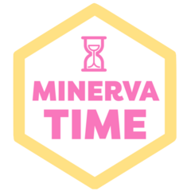

# MinervaTime 

<!-- badges: start -->
[](https://lifecycle.r-lib.org/articles/stages.html#experimental)
<!-- badges: end -->

The goal of MinervaTime is to implement temporal context representations within a MINERVA modeling framework and examine predictions from resulting models for redintegration and temporal expectation phenomena.

## Development notes

This repository is currently under development. Code will generally be created and tested in vignettes, and potentially migrated as functions into this R package.

## Installation

You can install the development version of MinervaTime like so:

``` r
# NOTHING TO SEE YET
```

## Example

This is a basic example which shows you how to solve a common problem:

``` r
library(MinervaTime)
## NOTHING HERE YET
```

